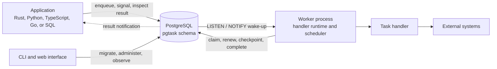

# Architecture

`pgtask` has no queue server or coordinator. Producers, workers, and operational tools connect directly to PostgreSQL.
PostgreSQL owns every durable state transition. Worker processes run user code and use PostgreSQL notifications to avoid
polling continuously.

Notifications are wake-up hints. The rows in PostgreSQL are the source of truth. A reconciliation poll recovers work
after a listener disconnects or misses a notification.

## Components

| Component | Responsibility |
| --- | --- |
| PostgreSQL schema | Stores tasks, attempts, leases, queues, checkpoints, waits, schedules, workers, and audit records. |
| Producer clients | Validate and encode requests, inject trace context, and call the public SQL functions. |
| Worker runtime | Claims supported tasks, runs handlers, renews leases, retries failures, and shuts down gracefully. |
| Embedded scheduler | Claims due schedules and materializes their occurrences as ordinary tasks. |
| CLI | Applies migrations and performs queue, retention, health, and grant operations. |
| Web interface | Reads security-barrier observer views and optionally exposes audited administrator actions. |
| OpenTelemetry integration | Propagates trace context and records worker, queue, task, and schedule telemetry. |

The Rust workspace keeps these responsibilities separate:

| Crate | Boundary |
| --- | --- |
| `pgtask-core` | Identifiers, task and schedule types, retry policy, and state values. It performs no database I/O. |
| `pgtask-postgres` | SQL migrations and the typed PostgreSQL store. |
| `pgtask-worker` | Handler registry, worker runtime, embedded scheduler, lease renewal, and health supervision. |
| `pgtask-otel` | Trace propagation and metric conventions. |
| `pgtask` | Public Rust facade that re-exports the core, storage, worker, and telemetry crates. |
| `pgtask-python` | Native Python bridge to the Rust store and worker runtime. |
| `pgtask-cli` | Administrative command-line application. |
| `pgtask-web` | Optional observer and administrator web application. |

The TypeScript and Go SDKs are producer clients. They call the same SQL protocol directly. The Python package combines a
Python API with the native Rust worker and storage implementation.

## Task execution

1. A producer calls `pgtask.enqueue`. The function inserts a `pending` task and notifies one of 64 deterministic
   `pgtask_ready_*` channels. Both actions commit with the producer's transaction.
2. A worker listening for notifications wakes and calls `pgtask.claim` for one logical queue. The claim uses
   `FOR NO KEY UPDATE ... SKIP LOCKED`, filters by the worker's registered task names and handler versions, creates an
   attempt, snapshots the handler version's retry policy, and assigns a lease token.
3. The worker commits the claim transaction before it calls the handler. User code never runs while the worker holds a
   database transaction open.
4. A background runtime task renews active leases in batches. The handler may checkpoint steps or suspend itself through
   the storage API while it runs.
5. The worker completes, retries, or fails the task with its task ID, attempt number, and lease token. PostgreSQL
   accepts the transition only while that exact lease still owns the task.
6. If a worker disappears, another worker recovers the task after its lease expires. The next claim creates a new
   attempt and lease token.

This design provides at-least-once execution. A handler can finish an external side effect and lose its lease before it
stores the result. Handlers must use stable idempotency keys when they change state outside PostgreSQL.

An unsupported task name or handler version remains `pending`. The database only returns tasks that match the
capabilities supplied by the claiming worker, so a deployment does not consume attempts for code it cannot run.
`pgtask.queue_overview` separates ready, routable, and unroutable counts. Workers export capability-aware ready demand
for autoscaling and a separate unroutable gauge for alerting.

A worker registers one immutable retry policy for each `(queue, task name, handler version)`. PostgreSQL rejects a
different policy under the same identity. A task snapshots the policy when the definition is already registered or
when it is first claimed. Later deployments cannot change retries for that task. Change the handler version when you
change its retry policy.

## Durable workflows

Durable operations are database transitions, not an in-memory workflow graph.

- A step stores one immutable checkpoint under `(task_id, handler_version, step_name, occurrence)`. A replay returns the
  stored JSON value.
- A durable sleep stores its checkpoint, changes the task to `pending`, sets a database deadline, and releases the
  lease.
- A signal wait or direct-child result wait changes the task to `waiting` and releases the lease. The signal, result,
  or timeout stores a checkpoint before returning the task to `pending`.
- A child spawn inserts the child task, records its parent, and checkpoints its identifier in one transaction.
- A terminal parent cancels unfinished descendants. A result timeout also cancels the awaited child subtree.
- Retention deletes terminal workflow leaves before their parents.

The handler runs again after a suspended task becomes ready. Stable step identities let it replay completed operations
and continue from the durable boundary. See [Durable execution](durable-execution.md) for the handler API and replay
rules.

## Scheduling

Scheduling runs inside every worker where scheduling is enabled. There is no leader process.

Workers claim due schedule definitions with `SKIP LOCKED`. Rust calculates the occurrences for the configured interval
or cron expression, then PostgreSQL advances `next_run_at` and inserts the tasks in one transaction. A unique
`(schedule_id, scheduled_for)` key prevents two workers from creating the same logical occurrence.

The scheduler uses `pgtask_schedule` and `pgtask_wait` notifications for prompt changes and periodically reconciles the
database. Every worker replica may claim schedule maintenance and wait recovery. `SKIP LOCKED` divides work without a
leader. Workers also recover expired leases for their queue and delete expired terminal tasks in bounded batches.

## Storage and protocol boundaries

All durable objects live in the `pgtask` schema. Logical queues share one `tasks` table and use partial indexes for the
claim and expired-lease paths. Separate tables retain attempt history, workflow checkpoints, signals, waits, schedule
occurrences, worker registrations, idempotency reservations, and administrator audit records.

An idempotency reservation has its own retention window. It remains active while its task is nonterminal, then expires
after the queue's configured idempotency retention. Deleting terminal task history does not release the key. This keeps
deduplication semantics independent from observability retention.

Administrator audit rows keep their task or schedule identifier after the target is deleted. The identifier is durable
audit data rather than a foreign key.

Clients mutate state through `SECURITY DEFINER` functions. Lease-owned transitions also require the current attempt and
lease token. Runtime roles do not need direct table access. Observer roles read security-barrier views instead. This SQL
surface is the cross-language protocol described in
[SQL protocol](sql-protocol.md).

The schema and each client declare an inclusive storage protocol range. Their ranges must overlap. Workers check before
registering or processing work. Normal SDK clients check at connection or first use. This makes rolling compatibility
an explicit database contract instead of an assumption based on package versions.
Schema changes within a rolling release remain additive so old and new binaries can run together. See
[Schema compatibility](schema-compatibility.md) for the migration rules.

## Deployment and scaling

A deployment requires PostgreSQL and one or more worker processes. The CLI and web interface are optional.

Each worker serves one logical queue and advertises its registered `(task_name, handler_version)` capabilities. You
scale execution by adding workers or increasing per-worker concurrency. You isolate workloads that need different
scaling, resources, or concurrency by assigning them to separate queues.

Workers use an ordinary connection pool for short state transitions and a separate session-capable endpoint for
`LISTEN`. One listener connection multiplexes the queue, scheduler, wait, and result channels used by a process.
Transaction-pooling proxies cannot provide this listener connection. Configure a direct PostgreSQL endpoint or a
PgBouncer session pool for it. PostgreSQL remains the only component required for correctness, so queue traffic,
retention, and application queries share its capacity.

Ready and result notifications use 64 deterministic shards each. A queue runtime only receives its queue payload. A
result waiter only receives its task payload. Notifications remain hints: every wake-up is followed by a state read,
and bounded reconciliation polling covers disconnects and missed notifications.

See [Failure model](failure-model.md) for recovery behavior and [Operations](operations.md) for production roles,
retention, draining, health checks, and incident response.
