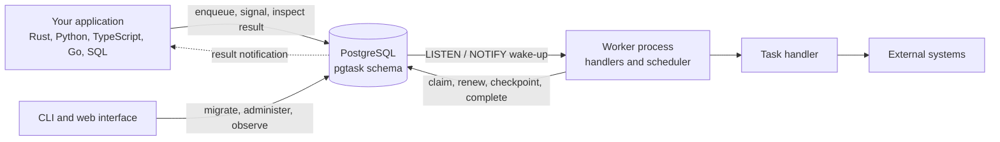

# The shape of the system

There is no queue server. There is no coordinator. There is no leader election.

Producers, workers, and tools connect directly to PostgreSQL. PostgreSQL owns every durable state transition. Worker
processes run your code and use notifications to avoid polling.

Every arrow is a database connection. Nothing sits between your code and PostgreSQL.

## Why there is nothing in the middle

A broker is a second place where truth lives. Once you have two, you have to keep them agreed.

The usual failure is not dramatic. Your transaction commits and the broker publish fails, so the work is never done. Or
the publish succeeds and the transaction rolls back, so a consumer processes an order that does not exist. Teams then
build an outbox table, a relay process, and a reconciliation job, which is to say they rebuild a database-backed queue
on top of the database they already had.

`pgtask` skips that. A task is a row. It commits with your data or not at all.

The cost is real and worth stating plainly: PostgreSQL now carries your queue load as well as your application load.
That is a capacity question you can measure, and it is a better problem to have than a consistency question you cannot
close.

## The parts

Each component has one responsibility, and none of them coordinate with each other:

| Component | Responsibility |
| --- | --- |
| Schema | Tasks, attempts, leases, queues, checkpoints, waits, schedules, workers, audit records |
| Producer clients | Validate requests, inject trace context, call the public SQL functions |
| Worker runtime | Claim tasks, run handlers, renew leases, retry failures, drain on shutdown |
| Embedded scheduler | Claim due schedules and materialize occurrences as ordinary tasks |
| CLI | Migrate, and perform queue, retention, health, and grant operations |
| Web interface | Read observer views, and optionally expose audited administrator actions |

The scheduler is not a separate service. It runs inside any worker you enable it on.

## Notifications are hints, never truth

This is the single idea that makes the design safe to reason about.

PostgreSQL sends a `NOTIFY` when a task becomes ready. A worker listening on that channel wakes immediately instead of
waiting for its next poll. That is the whole purpose: **latency**.

Correctness never depends on it. Every wake-up is followed by reading actual state. A worker that misses a
notification, loses its listener connection, or starts long after the notification was sent still finds the work,
because a bounded reconciliation poll runs regardless.

!!! note "Why this matters when you debug"

    If tasks are running but slowly, suspect the listener connection. If tasks are not running at all, the notification
    is almost never the cause. Look at capabilities, queue pause state, or capacity instead.

## Where to go next

The rest of this section takes each piece in turn:

- [How a task runs](task-lifecycle.md) covers claims, leases, and fencing.
- [Durable execution](durability.md) covers how a workflow survives a restart.
- [Scheduling without a leader](scheduling.md) covers why every worker can schedule.
- [The storage boundary](storage.md) covers the SQL surface and the role model.
- [Scaling and deployment](scaling.md) covers what to run, and what limits you first.
- [Failure model](../failure-model.md) covers recovery behaviour transition by transition.
