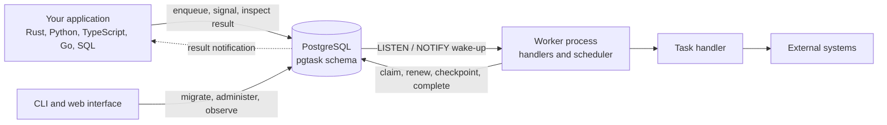

# The shape of the system

There is no queue server. There is no coordinator. There is no leader election.

Producers, workers, and tools connect directly to PostgreSQL. PostgreSQL owns every durable state transition. Worker
processes run your code and use notifications to avoid polling.

Every arrow is a database connection. Nothing sits between your code and PostgreSQL.

## The problem with a broker

A broker is a second place where truth lives, and the moment you have two you have to keep them agreed.

The failure is not dramatic, which is why it survives code review. You write your row and publish your message. Either
can fail independently. If the publish fails, the work is never done and your data says it should have been. If the
transaction rolls back after a successful publish, a consumer processes an order that does not exist.

The established answer is the [Transactional
Outbox](https://microservices.io/patterns/data/transactional-outbox.html): write the message to a table in the same
transaction, then relay it to the broker. It works. It also means you have built a queue in your database, plus a relay
process, plus a reconciliation job for when the relay falls behind - in order to feed a queue you are paying to operate
separately.

`pgtask` takes the observation seriously rather than working around it. If the durable record has to be in your database
anyway, the broker is the part that is optional. A task is a row. It commits with your data or not at all.

## What that costs

Every architecture is a trade, and this one has a specific bill.

**PostgreSQL carries the queue load.** Task churn, retention deletes, and your application queries share one instance.
This is a capacity question you can measure, which is a better class of problem than a consistency question you cannot
close, but it is a real constraint and it arrives sooner than people expect.

**There is no independent scaling knob.** With a broker you can grow the queue tier separately. Here, the queue's
headroom is the database's headroom.

**Throughput has a ceiling in the thousands per second, not the millions.** If you need the millions, this is the wrong
tool and no amount of tuning changes that.

I would put it this way: `pgtask` is for the very large number of systems that have a database, need background work,
and do not have queue volumes anywhere near their database's limits. That describes more systems than the popularity of
brokers suggests.

## The parts

Each component has one responsibility, and none of them coordinate with each other:

| Component | Responsibility |
| --- | --- |
| Schema | Tasks, attempts, leases, queues, checkpoints, waits, schedules, workers, audit records |
| Producer clients | Validate requests, inject trace context, call the public SQL functions |
| Worker runtime | Claim tasks, run handlers, renew leases, retry failures, drain on shutdown |
| Embedded scheduler | Claim due schedules and materialize occurrences as ordinary tasks |
| CLI | Migrate, and perform queue, retention, health, and grant operations |
| Web interface | Read observer views, and optionally expose audited administrator actions |

The scheduler is not a separate service. It runs inside any worker you enable it on, which is possible because
scheduling is made safe by a unique key rather than by electing someone to do it. See
[Schedules](../concepts/schedules.md).

## Notifications are hints, never truth

This is the single idea that makes the rest safe to reason about.

PostgreSQL sends a `NOTIFY` when a task becomes ready, and a worker listening on that channel wakes immediately instead
of waiting for its next poll. That is the whole purpose: latency.

Correctness never depends on it. Every wake-up is followed by reading actual state, and a bounded reconciliation poll
runs regardless. A worker that misses a notification, loses its listener connection, or starts long after the
notification was sent still finds the work.

The discipline this buys is worth naming. Because a lost notification is only ever a delay, the notification layer can
be optimised, sharded, or fail entirely without anyone auditing whether correctness still holds. Systems that treat
delivery as authoritative do not get to make that separation, and every change to their transport becomes a correctness
review.

!!! note "Why this matters when you debug"

    If tasks are running but slowly, suspect the listener connection. If tasks are not running at all, the notification
    is almost never the cause. Look at capabilities, queue pause state, or capacity instead.

## Where to go next

The rest of this section takes the two hard parts in turn, and the failure model states the recovery behaviour
transition by transition:

- [How a task runs](task-lifecycle.md) covers claims, leases, and fencing.
- [Durable execution](durability.md) covers how a workflow survives a restart.
- [Failure model](../failure-model.md) covers what happens when each step fails.
