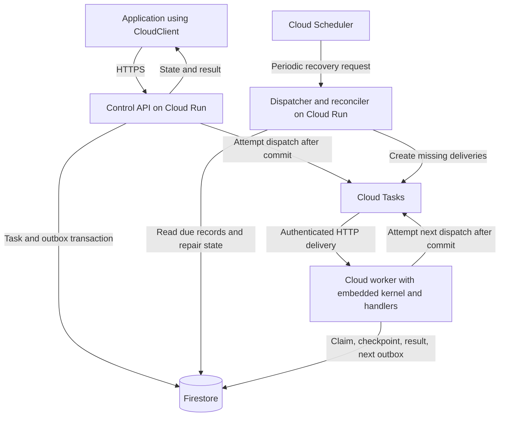

# Shared durable execution implementation plan

Status: proposed. This document plans implementation. The cloud APIs shown below do not exist yet.

## TL;DR

Extract the durable execution kernel from the PostgreSQL worker without changing existing APIs or guarantees. Keep
PostgreSQL as the default backend, then add an optional GCP runner that uses Firestore as the source of truth, Cloud Tasks
for delivery, and Cloud Run for control and execution services.

Implement this in gated stages. First capture current behavior and extract the kernel using PostgreSQL. Then prove
Firestore fencing, transactions, recovery, and workflow atomicity before exposing cloud APIs. Release only after a pilot
meets explicit correctness, latency, and cost targets. Existing workflows stay on their original backend, and unsupported
cloud features fail explicitly rather than receiving weaker approximations.

## Recommendation

Extract an execution library from the existing worker, retain PostgreSQL as the default backend, and add a GCP backend
using Firestore, Cloud Tasks, and Cloud Run. Keep the kernel embedded in workers. Preserve existing PostgreSQL APIs and SQL
guarantees while introducing explicit cloud clients and runners.

The goal is to move SaaS queue coordination and checkpoint traffic off PostgreSQL without requiring self-hosted users to
operate another service. Cost reduction and performance are acceptance questions to measure, not guarantees of the
abstraction.

The first cloud deployment runs trusted application handlers operated by the SaaS owner. Hosting arbitrary customer code
and workers in customer projects are separate designs.

## Current boundaries

| Area | Existing code | Planned change |
| --- | --- | --- |
| Domain types | `crates/pgtask-core` | Keep identifiers, values, and retry policy independent of infrastructure |
| Durable context | `crates/pgtask-worker/src/registry.rs` | Replace the concrete PostgreSQL `Store` dependency with an execution contract |
| Execution | `crates/pgtask-worker/src/runtime.rs`, especially `execute` | Extract handler invocation, replay context, outcome handling, and cancellation |
| PostgreSQL transitions | `crates/pgtask-postgres/src/store.rs` and SQL functions | Adapt existing atomic operations without moving their transaction logic into the worker |
| Python bridge | `sdks/python/src/lib.rs` | Share the native context and handler bridge across runners |
| Python API | `sdks/python/python/pgtask/client.py` | Preserve `Task`, `TaskRegistry`, definitions, and typed handles |
| Producer SDKs | `sdks/typescript`, `sdks/go` | Retain SQL clients; add cloud transport after the HTTP contract stabilizes |

Compatibility references are `docs/public-contracts.md`, `docs/failure-model.md`, and `docs/schema-compatibility.md`.
Repository SDK examples and tests are the verified consumers. External adopter usage still needs confirmation before
deprecating anything.

## Abstractions

| Component | Responsibility | Excludes |
| --- | --- | --- |
| `ExecutionKernel` | Run one claimed task segment; classify success, suspension, handler failure, and lease loss | Claim loops, HTTP servers, migrations |
| `TaskContext` | Checkpoint replay, sleep, signals, child operations | Queue discovery and transport |
| `ExecutionStore` | Fenced atomic transitions and durable reads | Generic database CRUD or caller-controlled transactions |
| PostgreSQL runner | Claims, batched renewal, notifications, recovery, scheduling | Cloud configuration |
| Cloud runner | Authenticate delivery, claim an exact task generation, supervise execution, acknowledge | Application retry policy inferred from HTTP delivery counts |
| Cloud delivery adapter | Create transport deliveries from durable outbox records | Workflow state authority |

Use Rust traits for internal cross-crate contracts and preserve concrete public clients. Avoid exposing a third-party
backend plugin API during this work. Choose static or object-safe dispatch during extraction based on the Python bridge
and measured overhead. Do not expose backend type parameters throughout the public API.

Proposed crate ownership:

```text
pgtask-core       domain types, transition inputs and outputs, store contracts
pgtask-runtime    kernel, handler registry, durable context
pgtask-postgres   PostgreSQL implementation and SQL protocol
pgtask-worker     existing PostgreSQL runner and compatibility re-exports
pgtask-gcp        Firestore adapter, delivery adapter, cloud runner
pgtask            existing facade plus additive cloud exports/features
```

Keep GCP dependencies optional for PostgreSQL installations. Service entry points compose these libraries. They need not
each become another public crate.

## Cloud service topology



The immediate dispatch attempt runs within the active request and has a bounded timeout. A durable outbox remains when
dispatch fails or the process exits. No background work after an HTTP response is required for correctness. Periodic
maintenance is the initial recovery mechanism. Event-driven wakeups can be added if measured recovery latency requires
them.

Start with separate control, execution, and maintenance service identities. They may share an image, but worker
concurrency and request timeouts must be configurable independently. Client credentials grant access through the API,
never direct database or execution-endpoint access. Bind task identity, tenant, queue, and handler version to trusted
routing configuration.

## Contract and invariants

1. A successful enqueue means task state and its delivery intent committed atomically. API retries with the same
   tenant-scoped idempotency key return the reserved task.
2. A delivery carries task identity and a delivery generation. An execution claim produces a separate fenced lease.
   Duplicate HTTP deliveries do not independently consume application attempts or start concurrent valid claims.
3. Every checkpoint and outcome checks the active lease. A late handler cannot overwrite a newer execution's state.
   Lease loss cancels the local handler, but cannot undo an external side effect.
4. Replay restarts the handler and reuses completed checkpoints by stable task, handler version, step name, and
   occurrence. Python stacks are not serialized. External side effects remain at least once.
5. The kernel computes retry decisions using the persisted policy. The store atomically commits the resulting state and
   any future delivery intent. Transport failures retry delivery. They do not define application retry policy.
6. Suspension commits before the worker acknowledges. Pending timers, signal waits, and child waits survive process
   termination. Suspend/resume and failed-attempt accounting must match the existing PostgreSQL contract.
7. Unknown transaction outcomes are resolved by reading authoritative state or repeating an idempotent transition. Never
   convert an ambiguous commit directly into another application attempt.
8. Retention of task history and idempotency reservations remains independent. An outbox record marked dispatched is not
   proof that execution completed.

Use semantic store operations such as checkpoint commit, suspend, register wait, spawn, complete, and fail. Keep
PostgreSQL batch claiming and cloud exact-task claiming backend-specific. Represent unavailable storage, unknown commit,
lease loss, unsupported capability, and handler failure separately. Preserve existing public PostgreSQL error behavior
through compatibility wrappers.

Firestore needs an explicit time and lease design. Do not assume it provides the same transaction-time expressions as
PostgreSQL. The prototype must establish how trusted server timestamps, bounded clock skew, expiry decisions, and local
monotonic cancellation deadlines interact before lease guarantees are advertised.

## Compatibility and cloud scope

| Behavior | PostgreSQL | Cloud target |
| --- | --- | --- |
| Existing `Client` and `Worker` imports | Unchanged | Add `CloudClient` and `CloudWorker` |
| Task definitions, JSON results, versioned handlers | Preserve | Same contract for supported tasks |
| Steps, retries, durable sleep, signals | Preserve | Required before cloud pilot |
| Child spawn, result waits, descendant cancellation | Preserve | Required for workflow parity; gate on atomicity proof |
| Transactional enqueue with application SQL | Preserve `enqueue_on` and batch variants | Unavailable across HTTP; document application outbox integration separately |
| Atomic batch enqueue | Preserve | Explicit bounded batch size or reject; never silently split into partial commits |
| Priority, starvation control, hard queue capacity | Preserve | Initially reject unsupported settings; do not approximate silently |
| Recurring schedules and catch-up | Preserve | Later cloud milestone with deduplicated occurrence materialization |
| Result waiting | Existing notification behavior | HTTP polling with backoff initially; same result and timeout semantics |

Do not rename all existing clients to `PostgresClient` just to introduce the cloud backend. Explicit PostgreSQL aliases
can be added later if useful. Do not migrate in-flight workflows between backends in the first release. Drain them on
their original backend.

Cloud HTTP segments must fit within the transport deadline. Long-lived workflows can span many deliveries, but a single
uninterrupted handler cannot run indefinitely. Timers beyond the scheduling horizon remain in Firestore until eligible
for delivery. Cloud Tasks currently limits dispatch to 500 tasks/sec per queue, scheduling to 30 days ahead, and retention
to 31 days. These limits require recovery and queue partitioning, not changes to workflow identity. See
[Cloud Tasks quotas](https://docs.cloud.google.com/tasks/docs/quotas) and
[HTTP deadlines](https://docs.cloud.google.com/tasks/docs/reference/rest/v2/projects.locations.queues.tasks).

## Proposed client example

This complete producer program illustrates the intended API after implementation. `PGTASK_CLOUD_URL` and
`PGTASK_CLOUD_TOKEN` identify an already deployed service. Deploy the same registry to a `CloudWorker` through a Python
ASGI entry point backed by the native kernel. Define its lifecycle and configuration in milestone 5.

```python
from __future__ import annotations

import asyncio
import os

from pgtask import Task, TaskRegistry
from pgtask.cloud import CloudClient

tasks = TaskRegistry("reports")


@tasks.task("reports.render")
async def render(task: Task, report_id: str) -> str:
    async def make_report() -> str:
        return f"rendered:{report_id}"

    return await task.step("render", make_report)


async def main() -> None:
    async with CloudClient(
        base_url=os.environ["PGTASK_CLOUD_URL"],
        token=os.environ["PGTASK_CLOUD_TOKEN"],
    ) as client:
        handle = await client.enqueue(render.request("report-123", idempotency_key="report-123:v1"))
        result = await handle.result(timeout=60)
        if result is None or result.state != "succeeded":
            raise RuntimeError(f"Report did not succeed: {result!r}")
        assert result.result == "rendered:report-123"


asyncio.run(main())
```

Preserve the existing `TaskResult.result` field and timeout return value. Use `httpx2` for the Python HTTP client. Keep
task definitions importable without opening connections or requiring GCP credentials.

## Milestones

### 1. Capture the contract and baseline

- Turn the current failure matrix into reusable public behavior scenarios, preserving existing tests.
- Establish the recording boundary before choosing the Google client transport. Prove one real request records and
  replays through the production adapter with external networking disabled. Python interception alone does not cover
  Rust-originated traffic.
- Record exact attempt accounting, retry-policy registration, checkpoint identity, cancellation, timeout, and result
  semantics.
- Measure PostgreSQL CPU, WAL volume, connection usage, throughput, and latency on representative workflows.
- Define the cloud pilot workload, maximum acceptable enqueue-to-start latency, and monthly budget from those
  measurements.

Exit: a written capability matrix and reproducible baseline. No implementation decision depends on the earlier
illustrative cost estimates.

### 2. Extract the kernel using PostgreSQL only

- Introduce transition types and the minimal `ExecutionStore` contract used by the current context and executor.
- Move registry/context/execution code to `pgtask-runtime`. Adapt PostgreSQL `Store` to the contract.
- Retain batched claims and lease renewal in `pgtask-worker`. Share supervision behavior without forcing identical
  scheduling mechanics.
- Preserve Rust import paths with re-exports or wrappers, Python exports and exception behavior, and SQL protocol
  compatibility.
- Adapt the Python native bridge while retaining cancellation, `ContextVar` propagation, and OpenTelemetry behavior.
- Replace the typed handle's concrete private `Client` dependency with a narrow internal producer protocol, retaining its
  public methods and result types.

Exit: existing Rust/Python worker tests, durable restart tests, SQL compatibility tests, producer SDK suites, and CLI
checks pass. The runtime has no PostgreSQL dependency. Compare the same benchmark before and after. Investigate
regressions outside measured run variance.

### 3. Prove the Firestore transaction model

- Build a private vertical slice: idempotent enqueue, exact-task claim, one checkpoint, completion, retry, and durable
  outbox.
- Separate task, checkpoint, lease, handler-policy, idempotency, and outbox records as needed for bounded transactions.
- Prove clock/lease handling, ambiguous commits, contention retries, and tenant scoping against a real test project.
- Use scattered identifiers and design due-work indexes to avoid timestamp hotspots. Avoid one global coordination
  document.
- Prototype atomic child spawn and the cancellation-vs-child-completion race now, before promising full workflow parity.

Exit: crash injection around every transaction boundary preserves the invariants. Record reads/writes and latency per
operation. If descendant cancellation cannot preserve the shared contract within Firestore transaction limits, stop
cloud parity work and revise the data model or supported scope explicitly. See
[Firestore transactions](https://firebase.google.com/docs/firestore/manage-data/transactions) and
[index design](https://firebase.google.com/docs/firestore/best-practices).

### 4. Add delivery and independent recovery

- Implement deterministic delivery names for retrying the same outbox operation. Use a new delivery identity when
  deliberately replacing an exhausted delivery. Keep execution fencing separate.
- Add bounded immediate dispatch after commit plus a scheduled, idempotent reconciler for undispatched records, expired
  leases, overdue pending tasks, and future timers.
- Do not rely on transport task-name deduplication as permanent task idempotency. A missing or exhausted Cloud Task must
  not strand a workflow.
- Implement authenticated worker delivery, handler-version routing, concurrency limits, lease renewal, cancellation, and
  shutdown.
- Define HTTP outcomes: acknowledge committed outcomes and obsolete deliveries; retry transient failures or unresolved
  commits. For a duplicate with a live lease, initially retry without invoking the handler again.
- Set execution deadlines below the configured HTTP deadline and cancel locally even if the transport disconnects without
  terminating the process.

Exit: demonstrate recovery from API death after commit, dispatcher death after creation, worker death before and after
checkpoint, duplicate delivery, transport retry exhaustion, and maintenance restart. Unsupported handler versions remain
observable and pending without exhausting application attempts.

### 5. Complete the portable workflow API

- Add durable sleep, signal-before-wait and signal-after-wait, timeouts, cancellation, atomic child spawn, child result
  waits, and descendant cancellation using the proven model.
- Add the authenticated control API and `CloudClient`: enqueue, inspect, result waiting, signal, cancel, and typed errors.
- Version the HTTP protocol independently of SQL storage protocol. Specify JSON encoding, size bounds, timeout behavior,
  idempotency scope, and feature rejection.
- Add `CloudWorker` lifecycle integration with the native runtime, ASGI startup/shutdown, handler registration, and Python
  cancellation.
- Keep full payloads and results in the state store. Delivery messages reference identities. Bound sizes explicitly
  rather than introducing object storage implicitly.

Exit: the same supported Rust and Python workflows pass backend conformance tests. Cross-tenant requests fail without
exposing task existence. Run Python network integration tests with real recorded interactions using `cassetter`. Keep
cloud end-to-end crash tests in an isolated test project.

### 6. Pilot, measure, and release

- Add deployment configuration for service identities, Firestore indexes, queues, recovery schedule, secrets, and
  concurrency limits.
- Add metrics for outbox age, schedule lag, delivery lag, retries, lease recovery, checkpoint operations, unavailable
  handler versions, and reconciliation progress. Preserve existing telemetry names and avoid task or tenant IDs as metric
  attributes.
- Extend the comparison harness to measure live enqueue-to-start and enqueue-to-durable-completion latency, including warm
  and cold execution. The existing harness excludes startup and uses a Redis completion counter. It is insufficient for
  this comparison alone.
- Compare tiny jobs, I/O jobs, CPU jobs, many-step workflows, long waits, and injected failures. Report p50/p95/p99,
  sustained throughput, backlog recovery, resource usage, and cost per completed workflow.
- Compare Dramatiq with stated broker persistence settings. Measure ordinary queue performance separately from workflows
  with equivalent checkpoint and recovery behavior.
- Include Cloud Run, Firestore reads/writes/indexes/storage, Cloud Tasks retries, maintenance, networking, logs, and
  development/operating effort in the cost model. Attribute PostgreSQL savings only to removable capacity or avoided
  upgrades.
- Route new tasks from a pilot queue to cloud. Keep existing tasks on PostgreSQL. Roll back by routing new submissions back
  and draining cloud executions on cloud.

Exit: the pilot meets milestone 1 latency and cost targets, recovers through fault tests without stranded tasks, and has
documented feature limits and upgrade procedures. Then add TypeScript and Go cloud producers against the stable HTTP
protocol and address recurring schedules as a separate feature milestone.

## Alternatives

- A separate kernel service adds an execution hop and a required service for self-hosting. Embed the library in each
  runner.
- Cloud Tasks with PostgreSQL checkpoints removes delivery work but retains the database traffic central to this goal.
- A generic queue interface cannot express atomic checkpoint, wait, and child transitions. Abstract execution persistence
  and keep delivery separate.
- One generic database transaction interface would expose backend internals and conceal incompatible atomicity limits.
- Google Workflows introduces another orchestration model. Revisit it only if maintaining this kernel proves
  uneconomical.
- Immediate Cloud Tasks creation without an outbox leaves a task-loss window between database commit and delivery
  creation.

## Validation and release boundary

Test externally visible behavior through clients, workers, HTTP endpoints, and the supported SQL surface. Inject failures
at process and transport boundaries. Cover concurrent claims, duplicate delivery, stale writes, replay after restart,
idempotency after history deletion, policy drift, signal/timeout races, cancellation races, partial batch rejection,
unknown commit recovery, and rolling handler versions.

Use emulators for quick feedback where useful, recorded real service interactions for SDK transport tests, and real GCP
integration runs for platform behavior. No emulator result substitutes for delivery, IAM, timing, or contention
validation.

### Recording, emulation, and cloud access

Use three complementary test layers:

| Layer | Tools | Contract exercised | Cloud access |
| --- | --- | --- | --- |
| Recorded adapter tests | `cassetter`, or a Rust transport integration using its cassette core | Actual request contents, response decoding, error classification, retry requests | Initial recording and deliberate refresh only |
| Local integration | Official Firestore emulator, pinned community Cloud Tasks emulator, local API and worker processes | State transitions, dispatch wiring, replay, process restarts, outbox recovery | None |
| Live integration | Isolated GCP test project | Real transaction contention, required indexes, IAM/OIDC, delivery and deadline behavior | Required |

`cassetter` documents Python HTTP and `grpc.aio` interception. The planned Google adapter runs in Rust, so verify or
implement the interception at that transport boundary rather than assuming `pytest.mark.vcr` captures native calls. A
cassette containing only client-to-control-API requests does not test the Google adapter. See
[cassetter's supported libraries and architecture](https://github.com/Kludex/cassetter).

Record requests and responses from real Google services using synthetic test data. Match request bodies as well as
method/resource identity, including transaction preconditions and mutations. Normalize only proven volatile values while
preserving cross-request identity relationships. Review credential filtering, including binary protobuf bodies, before
committing recordings. Run normal cassette tests in replay-only mode with external networking blocked. Refresh recordings
deliberately to detect service contract drift. Replay alone cannot discover new server behavior.

Evaluate [aertje/cloud-tasks-emulator](https://github.com/aertje/cloud-tasks-emulator) for the local delivery loop and pin
the tested version. It is a community implementation, not evidence of production parity. Google's
[Firestore emulator documentation](https://docs.cloud.google.com/firestore/native/docs/emulator) explicitly excludes
production transaction behavior, composite-index enforcement, and some limits. Keep concurrent lease claims and
cancellation races in the live suite even when local tests pass.

No GCP access is needed for kernel extraction, local emulator tests, or replaying committed cassettes. Recording real
Google interactions and validating the complete deployment require a dedicated test project with billing enabled. Use
short-lived local credentials or service-account impersonation and narrowly scoped CI federation. Test jobs use synthetic
data, isolated resources, and explicit cleanup. Production project access is unnecessary. Keep untrusted pull-request CI
offline. Run live tests and cassette refreshes only in a trusted environment.

The first implementation increment is milestones 1 and 2. It yields a reusable kernel with unchanged PostgreSQL behavior
and remains valuable even if the cloud economics do not justify shipping the second backend.
