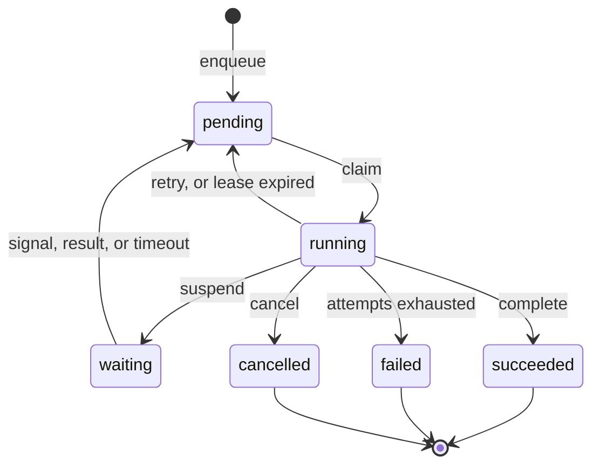

# How a task runs

A task moves through six states. Every transition is a row change in PostgreSQL, so you can always ask the database what
is true.



The `running` back to `pending` edge is the one you get for free: a lost worker returns its task without anyone
intervening.

## The sequence

Six steps take a task from enqueued to finished:

1. A producer calls `pgtask.enqueue`. The function inserts a `pending` task and notifies one of 64 deterministic
   `pgtask_ready_*` channels. Both actions commit with the producer's transaction.
2. A worker wakes and calls `pgtask.claim` for its queue. The claim selects with `FOR NO KEY UPDATE ... SKIP LOCKED`,
   filters to the worker's registered task names and handler versions, creates an attempt row, snapshots the retry
   policy, and assigns a fresh lease token.
3. **The worker commits the claim before it calls your handler.** Your code never runs while a database transaction is
   open.
4. A background task renews active leases in batches. Your handler can checkpoint steps or suspend itself while it runs.
5. The worker completes, retries, or fails the task using its task ID, attempt number, and lease token.
6. If the worker disappears, another worker recovers the task once the lease expires, as a new attempt with a new token.

Step 3 is the one people get wrong when they build this by hand. Holding a transaction open for the duration of a
handler ties your task throughput to your connection count and turns a slow handler into a database problem.

## Leases instead of acknowledgements

A claim does not remove the task. It stamps the row with a lease: an owner, an expiry, and a **lease token**, which is a
fresh UUID for that attempt.

Every state-changing call must present the task ID, the attempt number, **and** the lease token. PostgreSQL applies the
change only if that exact lease still owns the task:

```sql
WHERE id = p_task_id
  AND state = 'running'
  AND attempt = p_attempt
  AND lease_token = p_lease_token
```

That `WHERE` clause is the fencing. Consider the case it exists for:

1. Worker A claims the task and gets token `abc`.
2. Worker A stalls, through a long garbage collection pause, a network partition, or a suspended VM.
3. The lease expires. Worker B claims the same task, as attempt 2 with token `def`.
4. Worker A wakes up and confidently reports success with token `abc`.

Worker A's write matches zero rows. It is told it no longer owns the task. Without the token, a delayed write from a
zombie worker would silently overwrite the work of the live one.

!!! note "This is why renewal is not optional"

    Lease renewal is a background loop, not something your handler does. If renewal stops, because the database is
    unreachable, the lease expires and another worker takes over. That is the correct outcome, and it is why a handler
    should be safe to run again.

## Capabilities: unknown work is left alone

A worker registers the `(task_name, handler_version)` pairs it can run, and the claim filters on them.

A task whose name your deployment does not know stays `pending`. It is not claimed, not failed, and does not burn an
attempt.

This makes deploys safe in the direction that usually hurts. You can enqueue a new task type before the code that
handles it finishes rolling out. The work waits instead of failing.

`pgtask.queue_overview` separates the counts so you can tell the two situations apart:

| Count | Meaning |
| --- | --- |
| ready | Tasks eligible to run now |
| routable | Ready tasks some live worker has declared it can run |
| unroutable | Ready tasks no live worker can run |

Autoscale on routable demand. Alert on unroutable, because that number means you have deployed a producer without its
consumer.

## Priority, and the starvation escape hatch

Claims normally use the priority index: highest priority first, then oldest `run_at`.

Pure priority ordering starves low-priority work whenever high-priority work keeps arriving. So once an eligible task
has waited past the queue's `starvation_timeout_seconds`, one slot in each claim batch is filled from the oldest-ready
index instead.

Priority still decides the ordinary case. Old work gets a bounded, guaranteed path to execution rather than an
indefinite wait.

## Retry policies are immutable per handler version

A worker registers one retry policy for each `(queue, task_name, handler_version)`, and PostgreSQL rejects a different
policy under the same identity.

A task snapshots the policy when it is enqueued if the definition is already registered, or when it is first claimed.

This means a deploy cannot change the retry behaviour of tasks already in flight. If you want different retries, publish
a new handler version. The alternative, a policy that changes underneath queued work, makes incidents impossible to
reason about after the fact.

See [Retries](../concepts/retries.md) for the policy shapes.
