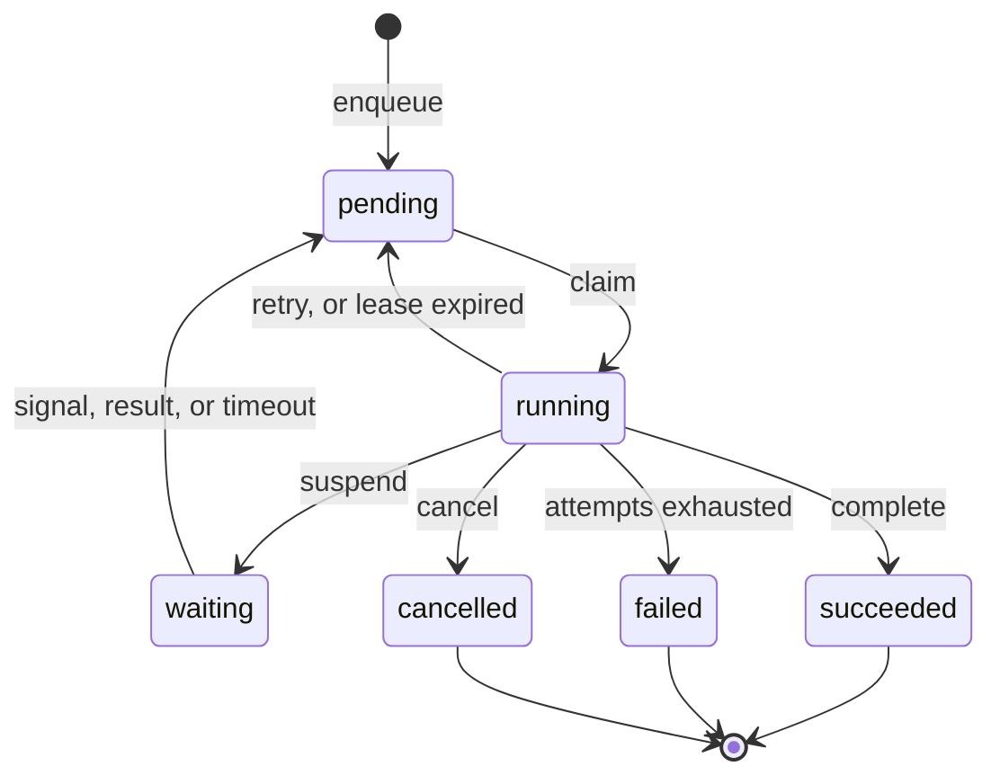

# How a task runs

Most queues hand a message to a consumer and wait to be told it is done. That works until the consumer stops answering,
and then you have to decide whether it is slow, dead, or about to wake up and finish the job you already gave to someone
else.

`pgtask` never asks that question. A task is a row, and a worker holds a time-limited claim on it. If the claim lapses,
the task is available again. Nobody has to decide whether the worker is dead, because nothing depends on knowing.



The `running` back to `pending` edge is the interesting one. It is not an error path that someone has to trigger; it is
what happens on its own when a lease is not renewed.

## The sequence

Six steps take a task from enqueued to finished:

1. A producer calls `pgtask.enqueue`. The function inserts a `pending` task and notifies one of 64 deterministic
   `pgtask_ready_*` channels. Both actions commit with the producer's transaction.
2. A worker wakes and calls `pgtask.claim` for its queue. The claim selects with `FOR NO KEY UPDATE ... SKIP LOCKED`,
   filters to the worker's registered task names and handler versions, creates an attempt row, snapshots the retry
   policy, and assigns a fresh lease token.
3. **The worker commits the claim before it calls your handler.** Your code never runs while a database transaction is
   open.
4. A background task renews active leases in batches. Your handler can checkpoint steps or suspend itself while it runs.
5. The worker completes, retries, or fails the task using its task ID, attempt number, and lease token.
6. If the worker disappears, another worker recovers the task once the lease expires, as a new attempt with a new token.

Step 3 deserves more attention than it usually gets. The tempting design is to claim and run inside one transaction, so
a crash rolls the claim back. It is simpler, and it is a trap: your task throughput becomes bound to your connection
count, a slow handler becomes a long-running transaction, and a handler that blocks becomes a database problem rather
than an application one. Committing the claim first costs you the guarantee that a crash undoes it, which is exactly the
guarantee the lease gives back.

## The problem leases solve

Suppose a worker claims a task and then stops responding. There are two things that could be happening, and from the
outside they look identical: the process has died, or it is about to carry on.

Give the task to someone else and you risk running it twice concurrently. Wait, and a dead worker stalls the queue
indefinitely. Neither answer is safe, and no amount of health checking makes the ambiguity go away - the worker can
always come back one instant after you decided it was gone.

The way out is not to detect death more accurately. It is to make the late writer harmless.

A claim stamps the row with an owner, an expiry, and a **lease token**: a fresh UUID for that attempt. Every
state-changing call must present the task ID, the attempt number, **and** that token. PostgreSQL applies the change only
if the lease still owns the task:

```sql
WHERE id = p_task_id
  AND state = 'running'
  AND attempt = p_attempt
  AND lease_token = p_lease_token
```

That token is a **fencing token**, the same device you find in distributed lock designs, and the `WHERE` clause is the
fence. Watch what it does to the ambiguous case:

<figure class="sequence" markdown="0">
<svg viewBox="0 0 700 250" role="img" aria-label="Worker A claims a task, stalls, and its later write is rejected because worker B now holds the lease.">
  <line class="rule" x1="60" y1="40" x2="660" y2="40" />
  <line class="rule" x1="60" y1="110" x2="660" y2="110" />
  <line class="rule" x1="60" y1="180" x2="660" y2="180" />

  <text class="lane" x="0" y="34">Worker A</text>
  <text class="lane" x="0" y="104">Worker B</text>
  <text class="lane" x="0" y="174">Lease</text>

  <g class="step-1">
    <rect class="work grow" x="60" y="18" width="150" height="16" rx="4" />
    <text class="note" x="60" y="12">claims, token abc</text>
  </g>

  <g class="step-2">
    <rect class="work-stalled" x="210" y="18" width="150" height="16" rx="4" />
    <text class="note" x="214" y="12">stalls</text>
  </g>

  <g class="step-1">
    <rect class="token" x="60" y="160" width="150" height="18" rx="4" />
    <text class="token-text" x="70" y="173">abc</text>
  </g>

  <g class="step-3">
    <text class="note" x="366" y="173">lease expires</text>
    <line class="rule" x1="360" y1="150" x2="360" y2="190" />
  </g>

  <g class="step-4">
    <rect class="token" x="360" y="160" width="200" height="18" rx="4" />
    <text class="token-text" x="370" y="173">def</text>
  </g>

  <g class="step-4">
    <rect class="work grow-late" x="360" y="88" width="200" height="16" rx="4" />
    <text class="note" x="360" y="82">claims, token def</text>
  </g>

  <g class="step-5">
    <text class="note" x="470" y="12">A returns, writes with abc</text>
    <line class="reject" x1="566" y1="16" x2="586" y2="36" />
    <line class="reject" x1="586" y1="16" x2="566" y2="36" />
    <text class="reject-text" x="596" y="31">0 rows</text>
  </g>

  <line class="playhead" x1="60" y1="6" x2="60" y2="200" />
</svg>
<figcaption>Worker A is not detected, blocked, or fenced off by a lock. Its write simply matches nothing.</figcaption>
</figure>

Worker A is never told to stop. It is not paused, killed, or coordinated with. It comes back, does what it intended, and
finds it changed nothing - and it learns that synchronously, from the row count, so it can log the loss rather than
report a success that never happened.

!!! note "This is why renewal is not optional"

    Lease renewal is a background loop, not something your handler does. If renewal stops because the database is
    unreachable, the lease expires and another worker takes over. That is the correct outcome, and it is the reason a
    handler must be safe to run again.

## Capabilities: unknown work is left alone

A worker registers the `(task_name, handler_version)` pairs it can run, and the claim filters on them.

A task whose name your deployment does not know stays `pending`. It is not claimed, not failed, and does not burn an
attempt.

The alternative - claim first, discover you cannot handle it, fail it - fails in the worst direction during a rollout.
It burns attempts on work that was never broken, at exactly the moment when half your fleet is old and half is new.
Filtering in the claim means you can deploy a producer before its consumer and the work simply waits.

`pgtask.queue_overview` separates the counts so you can tell the two situations apart:

| Count | Meaning |
| --- | --- |
| ready | Tasks eligible to run now |
| routable | Ready tasks some live worker has declared it can run |
| unroutable | Ready tasks no live worker can run |

Autoscale on routable demand. Alert on unroutable, because that number means you have deployed a producer without its
consumer.

## Priority, and the starvation escape hatch

Claims normally use the priority index: highest priority first, then oldest `run_at`.

Strict priority has a well-known failure. If high-priority work keeps arriving, low-priority work never runs, and the
system is behaving exactly as designed while a customer waits forever.

So once an eligible task has waited past the queue's `starvation_timeout_seconds`, one slot in each claim batch is
filled from the oldest-ready index instead. Priority still decides the ordinary case; the escape hatch bounds the worst
case. It is a deliberate compromise, and one slot is the whole of it - old work gets a guaranteed trickle, not a
takeover.

## Retry policies are immutable per handler version

A worker registers one retry policy for each `(queue, task_name, handler_version)`, and PostgreSQL rejects a different
policy under the same identity. A task snapshots the policy when it is enqueued if the definition is already registered,
or when it is first claimed.

The reason is what happens during an incident. If a policy applied at retry time rather than claim time, a deploy in the
middle of a backlog would change the behaviour of work already queued, and the timeline you reconstruct afterwards would
not match what actually ran. Freezing the policy to a handler version means the retry behaviour you observe is the
behaviour that was in force when the work was created.

To change retries, publish a new handler version. See [Retries](../concepts/retries.md).
